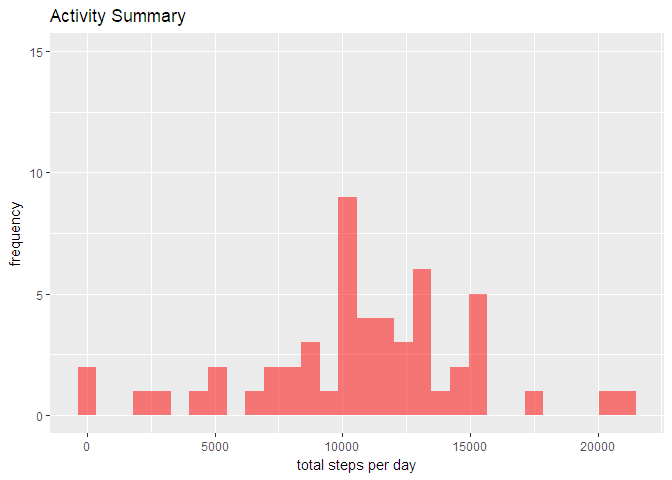
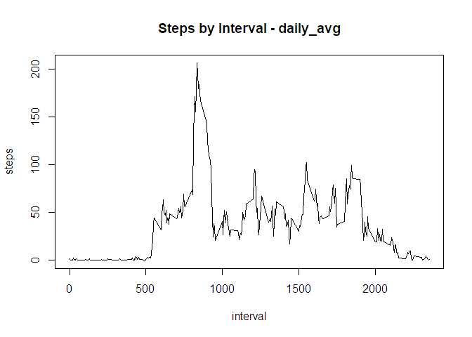
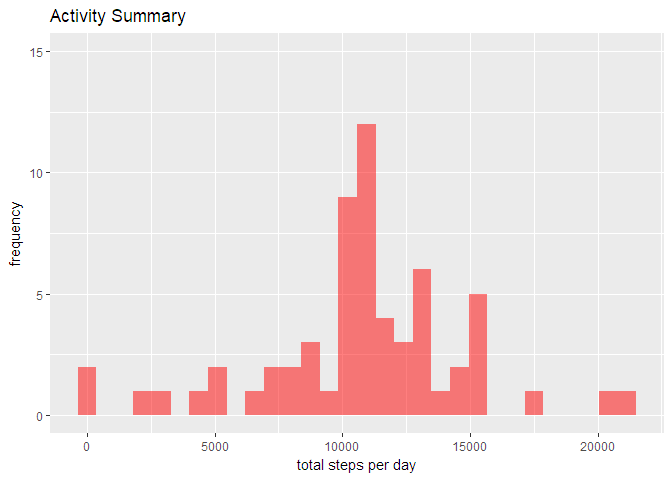
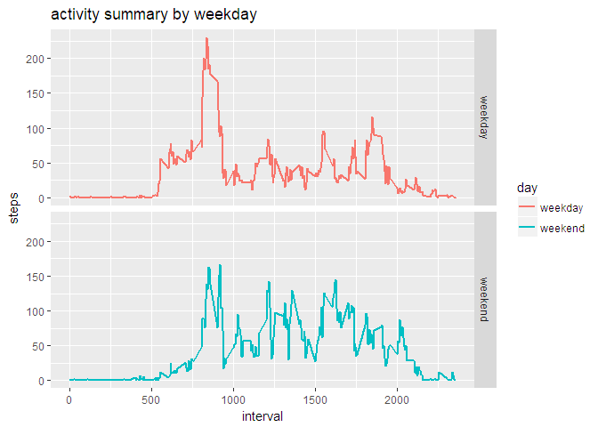

# PA1_template
generalinsight  
June 30, 2017  


```r
library(tidyverse)
```

```
## Loading tidyverse: ggplot2
## Loading tidyverse: tibble
## Loading tidyverse: tidyr
## Loading tidyverse: readr
## Loading tidyverse: purrr
## Loading tidyverse: dplyr
```

```
## Conflicts with tidy packages ----------------------------------------------
```

```
## filter(): dplyr, stats
## lag():    dplyr, stats
```


###Loading and preprocessing the data

Below processes were followed as steps

1. Loading the data (i.e. read.csv())


```r
activity <- read.csv("activity.csv", header = TRUE, sep = ",")
```

2. Processing/transforming the data into format suitable for analysis


```r
activity$date <- as.Date(activity$date, "%Y-%m-%d")
```


###Mean total number of steps taken per day

For this part of the assignment, we ignored the missing values in the dataset.Items executed are

1. a histogram of the total number of steps taken each day


```r
library(tidyverse)

daily_sum <- activity %>%
        group_by(date) %>%
        summarise(steps = sum(steps))

ggplot(daily_sum, aes(steps)) +
        geom_histogram(fill = "red", alpha = 0.5) +
        labs(x = "total steps per day", y = "frequency", title = "Activity Summary") +
        coord_cartesian(ylim = c(0,15))
```

```
## `stat_bin()` using `bins = 30`. Pick better value with `binwidth`.
```

```
## Warning: Removed 8 rows containing non-finite values (stat_bin).
```

<!-- -->


2. Mean was 1.07662\times 10^{4} and median was 10765 for total number of steps taken per day


```r
mean(daily_sum$steps, na.rm = TRUE)
```

```
## [1] 10766.19
```

```r
median(daily_sum$steps, na.rm = TRUE)
```

```
## [1] 10765
```


### The average daily activity pattern


1. We made a time series plot (i.e. type = "l") of the 5-minute interval (x-axis) and the average number of steps taken, averaged across all days (y-axis)


```r
daily_avg <- activity %>%
        group_by(interval) %>%
        summarise(steps = mean(steps, na.rm = TRUE)) %>%
        print()
```

```
## # A tibble: 288 x 2
##    interval     steps
##       <int>     <dbl>
##  1        0 1.7169811
##  2        5 0.3396226
##  3       10 0.1320755
##  4       15 0.1509434
##  5       20 0.0754717
##  6       25 2.0943396
##  7       30 0.5283019
##  8       35 0.8679245
##  9       40 0.0000000
## 10       45 1.4716981
## # ... with 278 more rows
```

```r
plot(daily_avg, type = "l", main = "Steps by Interval - daily_avg")
```

<!-- -->


2. We identified that 835 interval, on average across all the days in the dataset, contains the maximum number of steps


```r
daily_avg$interval[which.max(daily_avg$steps)]
```

```
## [1] 835
```


###Imputing missing values

Note that there were a number of days/intervals where there are missing values (coded as NA). The presence of missing days may introduce bias into some calculations or summaries of the data.

1. The total number of missing values in the dataset (i.e. the total number of rows with NAs)


```r
nrow(filter(activity, is.na(steps) == TRUE))
```

```
## [1] 2304
```


2. Strategy for filling in all of the missing values were identified thru careful considerations. Mean steps for that 5-minute interval across all days were used to imput missing steps data.


3. New dataset that was equal to the original dataset but with the missing data filled in. **Nonmissing** below had no missing data, whereas, **missing** dataset, as identified below, did have "NA" as steps. Per process below, the missing field was filled in with mean steps for the same 5-minute interval calculated over all available day's data.  


```r
nonmissing <- filter(activity, is.na(steps) == FALSE)

missing <- filter(activity, is.na(steps) == TRUE) %>%
        select(date, interval) %>%
        left_join(daily_avg, by = "interval")

activity1 <- rbind(nonmissing, missing) %>%
        arrange(date, interval)
```


4. Below is the process for creating histogram of the total number of steps taken each day, and Calculating and reporting the mean and median total number of steps taken per day. While the mean remained same, the median changed slightly to become same with mean now, which logically makes sense since the missing data has been filled in now with 'mean's from the available data. As well, there is some impact of imputing missing data on the estimates of the total daily number of steps - this has increased from before.


```r
daily_sum_1 <- activity1 %>%
        group_by(date) %>%
        summarise(steps = sum(steps))


ggplot(daily_sum_1, aes(steps)) +
        geom_histogram(fill = "red", alpha = 0.5) +
        labs(x = "total steps per day", y = "frequency", title = "Activity Summary") +
        coord_cartesian(ylim = c(0,15))
```

```
## `stat_bin()` using `bins = 30`. Pick better value with `binwidth`.
```

<!-- -->

```r
mean(daily_sum_1$steps, na.rm = TRUE)
```

```
## [1] 10766.19
```

```r
median(daily_sum_1$steps, na.rm = TRUE)
```

```
## [1] 10766.19
```


### Differences in activity patterns between weekdays and weekends

The dataset with the filled-in missing values was used for this part.

1. A new factor variable was created in the dataset with two levels -- "weekday" and "weekend" indicating whether a given date is a weekday or weekend day


```r
library(chron)

activity1 <- activity1 %>% 
        mutate(weekend = chron::is.weekend(date)) %>%
        mutate(day = ifelse(weekend == TRUE, "weekend", "weekday"))
        
activity1_avg <- activity1 %>%
        group_by(day, interval) %>%
        summarise(steps = mean(steps))

activity1_avg_weekday <-filter(activity1_avg, day == "weekday") 
activity1_avg_weekend <-filter(activity1_avg, day == "weekend") 
```


2. Make a panel plot containing a time series plot (i.e. type = "l") of the 5-minute interval (x-axis) and the average number of steps taken, averaged across all weekday days or weekend days (y-axis). The plot should look something like the following, which was created using simulated data.
        


```r
ggplot(activity1_avg, aes(interval, steps)) +
        geom_line(aes(col = day), lwd = 1) +
        facet_grid(day ~ .) +
        labs(x = "interval", y = "steps", title = "activity summary by weekday")
```

<!-- -->
